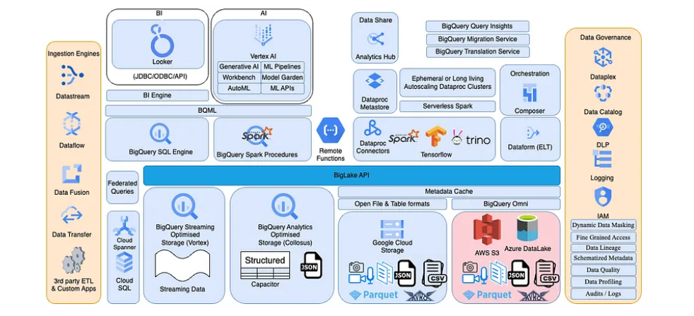

# Overview
I recently completed 3 Google Cloud Professional Certifications, which was after completing a [100-day challenge](https://github.com/lgarzia/GCP_100Days), and I still feel like I'm barely scratching the surface. GCP continues to evolve with new services, features, and paradigms. My learnings are more [project-based](https://github.com/lgarzia/topic_extractions) now, but I will leverage this section to capture pertinent ideas and trends to stay relevant.

## Analytics Lakehouse

The following article lays out an end-to-end vision of where analytical systems are heading (have headed).
[Analtyics Lakehouse Medium Article](https://medium.com/google-cloud/analytics-lakehouse-on-gcp-principles-and-building-blocks-116f4eb94a45)

## BigQuery
My Medium articles:
* [JSON Data Types](https://medium.com/@garzia.luke/brief-guide-to-effectively-leverage-json-data-type-in-bigquery-a3185d9fe88b)
* [BigQuery UDFs](https://medium.com/@garzia.luke/bigquery-udfs-leverage-learn-from-community-contributed-projects-7ddff089f35a)
* [Remote Functions](https://medium.com/@garzia.luke/bigquery-remote-functions-identifying-valid-use-cases-1f80a6f55767)

## BigLake
* [BigQueryover Iceberg](https://cloud.google.com/blog/products/data-analytics/announcing-apache-iceberg-support-for-biglake)
